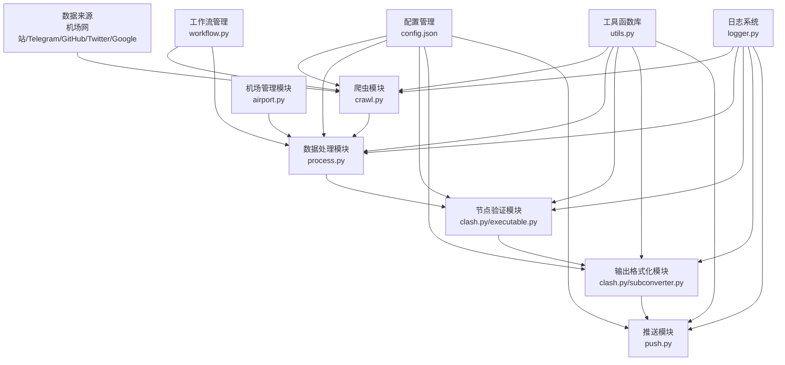

# Aggregator 项目说明文档

## 1. 项目概述

### 1.1 项目简介
Aggregator 是一个功能强大的免费代理节点聚合工具，其核心价值在于自动化地爬取、处理和管理来自多个渠道的免费代理节点资源。该项目设计初衷是帮助用户高效获取和使用各类网络代理资源，同时提供灵活的插件系统以适应不同网站的爬取需求。

### 1.2 主要功能与亮点
- **多渠道聚合**：自动从机场网站、Telegram、GitHub、Twitter、Google、Yandex等多种渠道爬取代理节点
- **灵活的配置系统**：支持通过配置文件自定义爬取规则、过滤条件和输出格式
- **节点存活检测**：自动检测代理节点的可用性、延迟和连接质量
- **自动账号注册与续费**：支持自动注册机场账号、签到和续费免费套餐
- **多种输出格式**：支持 Clash、Sing-box、V2Ray 等多种代理客户端格式
- **插件化架构**：提供灵活的插件系统，支持自定义爬取逻辑
- **多线程处理**：采用多线程技术提升爬取和处理效率
- **智能过滤机制**：通过关键词、正则表达式等方式过滤不需要的内容
- **数据持久化**：支持将爬取结果推送到GitHub Gist等平台进行存储

### 1.3 应用场景
- 网络爱好者获取免费代理资源进行网络访问
- 开发者测试和验证代理节点质量和性能
- 网络爬虫项目构建IP池资源，避免IP限制
- 研究网络代理技术、爬虫技术和数据处理方法
- 搭建个人代理订阅服务，方便日常使用

## 2. 目录结构

Aggregator 项目采用模块化设计，代码结构清晰。主要分为核心功能模块（subscribe目录）、辅助工具（tools目录）和第三方工具集成（clash、subconverter目录）等部分。subscribe目录包含了项目的核心功能实现，如爬虫模块、数据处理模块、机场管理模块等；tools目录提供了一些辅助脚本和工具函数，用于特定场景下的功能扩展。

```
├── .dockerignore                # Docker忽略文件配置
├── .github/                     # GitHub相关配置
│   ├── actions/                 # GitHub Actions工作流配置
│   └── workflows/               # GitHub工作流定义
├── Dockerfile                   # Docker构建文件
├── LICENSE                      # 项目许可证
├── README.md                    # 项目说明文档
├── clash.ico                    # Clash图标文件
├── clash/                       # Clash客户端相关文件
│   ├── Country.mmdb             # 地理位置数据库
│   ├── clash-darwin-amd         # macOS AMD架构可执行文件
│   ├── clash-darwin-arm         # macOS ARM架构可执行文件
│   ├── clash-linux-amd          # Linux AMD架构可执行文件
│   ├── clash-linux-arm          # Linux ARM架构可执行文件
│   └── clash-windows-amd.exe    # Windows AMD架构可执行文件
├── cmd/                         # 命令行工具
│   └── alive-check.sh           # 节点存活检测脚本
├── requirements.txt             # Python依赖包列表
├── subconverter/                # Subconverter工具相关文件
│   ├── base/                    # 基础配置
│   ├── config/                  # 配置文件
│   ├── gistconf.ini             # Gist配置
│   ├── pref.example.ini         # 偏好设置示例
│   ├── pref.example.toml        # Toml格式偏好设置示例
│   ├── pref.example.yml         # Yaml格式偏好设置示例
│   ├── pref.toml                # Toml格式偏好设置
│   ├── profiles/                # 配置文件模板
│   ├── rules/                   # 规则配置
│   ├── snippets/                # 配置片段
│   ├── subconverter-darwin-amd  # macOS AMD架构可执行文件
│   ├── subconverter-darwin-arm  # macOS ARM架构可执行文件
│   ├── subconverter-linux-amd   # Linux AMD架构可执行文件
│   ├── subconverter-linux-arm   # Linux ARM架构可执行文件
│   └── subconverter-windows-amd.exe  # Windows AMD架构可执行文件
├── subscribe/                   # 核心功能模块
│   ├── __init__.py              # Python包初始化
│   ├── airport.py               # 机场相关功能实现
│   ├── clash.py                 # Clash客户端相关功能
│   ├── collect.py               # 代理节点收集入口（小型工具）
│   ├── config/                  # 配置文件目录
│   │   ├── .gitkeep             # Git占位文件
│   │   └── config.default.json  # 默认配置文件
│   ├── crawl.py                 # 爬虫核心功能
│   ├── executable.py            # 可执行文件管理
│   ├── location.py              # 地理位置相关功能
│   ├── logger.py                # 日志管理
│   ├── mailtm.py                # 临时邮箱功能
│   ├── origin.py                # 原始数据处理
│   ├── process.py               # 代理节点处理主入口
│   ├── push.py                  # 推送相关功能
│   ├── renewal.py               # 账号续费功能
│   ├── scripts/                 # 自定义脚本
│   ├── subconverter.py          # Subconverter工具封装
│   ├── urlvalidator.py          # URL验证工具
│   ├── utils.py                 # 工具函数集
│   └── workflow.py              # 工作流管理
├── tools/                       # 辅助工具集
│   ├── auto-checkin.py          # 自动签到脚本
│   ├── clean.py                 # 清理工具
│   ├── config.json              # 工具配置文件
│   ├── filter.py                # 过滤器工具
│   ├── ip-location.py           # IP地理位置查询
│   ├── purefast.py              # 高速处理工具
│   ├── renewal.py               # 续费工具
│   ├── scaner.py                # 扫描工具
│   └── xui.py                   # XUI相关工具
└── 项目说明文档.md               # 项目详细说明文档
```

**核心目录和文件详细说明：**

- **subscribe/**: 项目的核心功能模块，包含了代理节点的爬取、处理、验证和输出等主要功能实现。
  - **crawl.py**: 实现从各种渠道爬取代理节点的核心逻辑
  - **process.py**: 项目的主要入口，协调整个工作流程
  - **airport.py**: 机场网站交互、账号管理和订阅获取
  - **utils.py**: 提供各种通用工具函数，如网络请求、字符串处理等
  - **config/**: 存放配置文件的目录，包含默认配置文件
  - **scripts/**: 存放自定义爬取脚本的目录，支持扩展爬取功能
  - **logger.py**: 日志系统，提供统一的日志记录功能
  - **workflow.py**: 工作流管理，定义任务执行流程

- **tools/**: 提供了一系列辅助工具和脚本，用于特定场景下的功能扩展。
  - **auto-checkin.py**: 自动签到脚本，用于机场账号自动签到获取流量
  - **filter.py**: 节点过滤工具，根据规则筛选代理节点
  - **ip-location.py**: IP地理位置查询工具
  - **renewal.py**: 账号续费工具，支持自动续费机场账号

- **subconverter/**: 包含Subconverter工具及其配置，用于转换不同格式的代理订阅。
  - **base/**: Subconverter的基础配置文件
  - **profiles/**: 预设的配置文件模板
  - **rules/**: 规则配置文件
  - **pref.toml**: 偏好设置，控制Subconverter的转换行为

- **clash/**: 包含Clash客户端及其配置，用于节点测试和验证。
  - **Country.mmdb**: 用于地理位置识别的数据库
  - 各平台Clash客户端可执行文件（Windows、macOS、Linux）

## 3. 系统架构与主流程

### 3.1 系统架构图



Aggregator 项目采用模块化、可扩展的系统架构，各模块之间职责清晰，通过配置文件进行解耦。系统的核心是爬虫模块、数据处理模块、节点验证模块和输出格式化模块，这些模块协同工作，完成从数据获取到最终输出的全流程。

### 3.2 系统核心模块关系

各模块之间的关系和数据流向：
- **配置管理**：为所有模块提供配置参数，控制各模块的行为
- **爬虫模块**：从多个渠道获取原始数据，传递给数据处理模块
- **数据处理模块**：协调整个工作流程，处理原始数据并传递给验证模块
- **节点验证模块**：验证节点质量，将结果返回给数据处理模块
- **输出格式化模块**：根据配置将处理后的节点转换为不同格式
- **推送模块**：将最终结果推送到指定平台
- **工具函数库**：为所有模块提供通用功能支持
- **机场管理模块**：负责与机场网站交互，获取订阅信息
- **工作流管理**：定义和管理任务执行流程
- **日志系统**：记录系统运行状态和各模块的操作日志

### 3.3 主流程详解

系统的主流程主要围绕两个入口文件展开：`collect.py`（小型工具）和`process.py`（主要入口）。根据README中的建议，推荐使用`process.py`以获得更完整的功能。

#### 3.3.1 process.py 的主要工作流程

1. **配置加载阶段**
   - 通过`load_configs()`函数加载和解析配置文件
   - 初始化各模块的配置参数
   - 设置环境变量和运行参数

2. **任务分配阶段**
   - 根据配置创建爬取任务队列
   - 配置各渠道的爬取参数（如Telegram、GitHub、Google等）
   - 初始化多线程处理池

3. **数据爬取阶段**
   - 调用`batch_crawl()`函数启动多线程爬取
   - 从各渠道并行爬取代理节点数据
   - 对爬取的数据进行初步过滤和去重
   - 支持从本地存储恢复历史爬取结果

4. **数据处理阶段**
   - 对爬取到的数据进行清洗、标准化处理
   - 根据配置对节点进行分类和分组
   - 合并来自不同渠道的节点数据
   - 应用用户定义的过滤规则

5. **节点验证阶段**
   - 调用Clash客户端进行节点存活检测
   - 测试节点的延迟和连接质量
   - 根据测试结果过滤低质量节点
   - 生成节点质量报告

6. **输出生成阶段**
   - 根据用户配置生成不同格式（Clash、Sing-box、V2Ray等）的输出文件
   - 应用节点重命名规则和分组配置
   - 生成订阅链接和配置文件

7. **推送分发阶段**
   - 将生成的订阅链接和配置文件推送到指定平台（如Gist、GitHub等）
   - 更新已有的推送内容
   - 记录推送日志和结果

#### 3.3.2 collect.py 的工作流程

相比`process.py`，`collect.py`是一个简化版本的入口文件，主要用于快速收集和处理代理节点：

1. 加载配置文件和域名列表
2. 创建爬取任务配置
3. 执行爬取和处理流程
4. 生成输出文件

该文件适合快速测试和简单使用场景。

### 3.4 多线程处理机制

项目采用了多线程技术来提高爬取和处理效率，特别是在`crawl.py`和`utils.py`中实现了以下多线程机制：

- **多线程爬取**：通过`multi_thread_run()`函数实现，同时从多个渠道爬取数据
- **线程池管理**：动态调整线程数量，避免资源耗尽
- **任务队列**：有序管理爬取任务，确保任务均衡分配
- **结果合并**：将多线程的爬取结果合并处理

核心的多线程实现代码如下：

```python
# utils.py中的多线程运行函数
def multi_thread_run(func: typing.Callable, tasks: list, num_threads: int = 20, show_progress: bool = True) -> list:
    # 根据任务数量调整线程数
    num_threads = max(min(num_threads, len(tasks)), 1)
    results = [None] * len(tasks)
    
    # 使用线程池执行任务
    with concurrent.futures.ThreadPoolExecutor(max_workers=num_threads) as executor:
        # 提交任务并创建future对象列表
        future_to_index = {executor.submit(func, *task if isinstance(task, list) else (task,)): i for i, task in enumerate(tasks)}
        
        # 处理完成的任务并显示进度
        for i, future in enumerate(concurrent.futures.as_completed(future_to_index)):
            index = future_to_index[future]
            try:
                results[index] = future.result()
            except Exception as e:
                results[index] = None
                logger.error(f"Task {index} generated an exception: {e}")
            
            # 显示进度
            if show_progress:
                progress_bar(i + 1, len(tasks), prefix="Progress", suffix="Complete", length=50)
                
    return results
```

## 4. 核心功能模块

### 4.1 爬虫模块 (crawl.py)

爬虫模块是Aggregator项目的核心，负责从各种渠道爬取代理节点资源。该模块采用多线程技术，支持同时从多个渠道爬取数据，大大提高了爬取效率。

**主要功能：**
- 支持从机场网站、Telegram、GitHub、Twitter、Google、Yandex等多种渠道爬取代理节点
- 提供灵活的过滤机制，可以根据关键词、正则表达式等过滤不需要的内容
- 支持自定义爬取规则，适应不同网站的结构
- 实现了自动去重功能，避免重复爬取相同的节点
- 支持从本地存储恢复历史爬取结果，避免重复爬取

**核心实现机制：**
- **模块化设计**：为不同渠道设计了专门的爬取函数
- **URL验证**：使用`urlvalidator.py`验证爬取到的URL有效性
- **内容解析**：支持解析各种格式的节点信息，包括base64编码、YAML格式等
- **错误重试**：内置错误处理和重试机制，提高爬取成功率

**关键函数与方法：**

```python
# 多线程爬取函数，接收爬取函数和参数列表，返回合并后的结果
def multi_thread_crawl(func: typing.Callable, params: list) -> dict:
    # 实现多线程爬取逻辑
    # 合并爬取结果
    # 返回处理后的任务字典
```

```python
# 批量爬取函数，根据配置从多个渠道爬取数据
def batch_crawl(conf: dict, num_threads: int = 50, display: bool = True) -> list[dict]:
    # 获取运行模式
    # 初始化存储和推送配置
    # 从各渠道（Google、Yandex、Telegram、Twitter、GitHub等）爬取数据
    # 返回爬取结果
```

```python
# 从Telegram爬取数据
def crawl_telegram(users: dict, pages: int = 5) -> dict:
    # 遍历配置的Telegram用户/频道
    # 爬取最新消息
    # 解析消息中的节点信息
    # 返回处理后的结果
```

```python
# 从GitHub爬取数据
def crawl_github(conf: dict) -> dict:
    # 搜索相关仓库和代码
    # 解析文件中的节点信息
    # 过滤垃圾内容
    # 返回处理后的结果
```

### 4.2 数据处理模块 (process.py)

数据处理模块是项目的主要入口，负责协调整个工作流程，包括配置加载、任务分配、数据处理和输出生成等。

**主要功能：**
- 加载和解析用户配置
- 协调各模块的工作流程
- 对爬取到的数据进行清洗、过滤和标准化处理
- 管理节点的分类和分组
- 生成最终输出文件

**核心实现机制：**
- **配置解析**：递归解析复杂的配置结构
- **任务协调**：有序调用各模块的功能
- **数据转换**：将不同格式的数据转换为统一格式
- **异常处理**：完善的错误处理机制，确保程序稳定运行

**关键组件与函数：**

```python
# ProcessConfig类，定义了处理流程的配置结构
@dataclass
class ProcessConfig(object):
    tasks: list[dict] = field(default_factory=list)  # 任务列表
    crawl: dict = field(default_factory=dict)        # 爬取配置
    storage: dict = field(default_factory=dict)      # 存储配置
    groups: dict[dict] = field(default_factory=dict) # 分组配置
    update: dict = field(default_factory=dict)       # 更新配置
    delay: int = 5000                                # 最大可接受延迟
```

```python
# 加载配置函数，解析配置文件并初始化系统

def load_configs(url: str, only_check: bool = False, num_threads: int = 0, display: bool = True) -> ProcessConfig:
    # 加载配置文件
    # 解析配置结构
    # 初始化各模块配置
    # 返回ProcessConfig对象
```

### 4.3 机场管理模块 (airport.py)

机场管理模块负责与机场网站交互，包括自动注册账号、登录、获取订阅链接和续费等功能。

**主要功能：**
- 自动注册机场账号（支持临时邮箱）
- 自动登录并获取订阅链接
- 自动检测账号状态和流量使用情况
- 支持自动续费免费套餐
- 支持自动签到获取流量

**核心实现机制：**
- **模拟登录**：通过HTTP请求模拟用户登录过程
- **表单提交**：自动填充和提交表单数据
- **验证码处理**：支持处理简单的验证码
- **会话管理**：维护HTTP会话，保持登录状态

**关键组件与方法：**

```python
# AirPort类，封装了与机场网站交互的核心功能
class AirPort:
    def __init__(self, domain: str, config: dict = None):
        # 初始化机场配置和会话
        
    def register(self) -> bool:
        # 自动注册机场账号
        # 返回注册是否成功
        
    def login(self) -> bool:
        # 自动登录机场账号
        # 返回登录是否成功
        
    def get_subscribe(self) -> str:
        # 获取订阅链接
        # 返回订阅内容
        
    def checkin(self) -> bool:
        # 自动签到获取流量
        # 返回签到是否成功
        
    def renew(self) -> bool:
        # 自动续费账号
        # 返回续费是否成功
```

### 4.4 节点验证模块 (clash.py 与 executable.py)

节点验证模块负责检测代理节点的可用性和性能，确保输出的节点质量。该模块主要通过集成Clash客户端实现节点测试功能。

**主要功能：**
- 检测节点的存活状态
- 测试节点的延迟和连接速度
- 根据测试结果过滤低质量节点
- 生成节点质量报告

**核心实现机制：**
- **Clash集成**：调用Clash客户端进行节点测试
- **多线程测试**：支持同时测试多个节点，提高效率
- **结果解析**：解析Clash的测试结果，提取有用信息
- **自动重试**：对测试失败的节点进行有限次数的重试

**关键组件与方法：**

- `executable.py`：管理和调用Clash等可执行文件
- `clash.py`：封装Clash客户端的功能，实现节点测试
- 支持跨平台调用不同版本的Clash客户端

### 4.5 输出格式化模块 (clash.py 与 subconverter.py)

输出格式化模块负责将处理后的节点数据转换为不同客户端支持的格式。该模块支持Clash、Sing-box、V2Ray等多种代理客户端格式。

**主要功能：**
- 支持Clash、Sing-box、V2Ray等多种客户端格式
- 提供灵活的节点重命名和分组功能
- 支持自定义规则和策略组配置
- 生成标准化的配置文件

**核心实现机制：**
- **格式转换**：将统一格式的节点数据转换为特定客户端格式
- **规则应用**：应用用户定义的重命名规则和分组规则
- **模板渲染**：使用模板渲染技术生成配置文件
- **Subconverter集成**：利用Subconverter工具实现高级格式转换

**关键组件与方法：**

```python
# subconverter.py中的函数，用于转换订阅格式
def convert(config: dict, content: str, target: str = "clash") -> str:
    # 调用Subconverter工具
    # 转换订阅格式
    # 返回转换后的内容
```

```python
# clash.py中的函数，用于生成Clash配置
def generate_clash_config(proxies: list, groups: dict) -> str:
    # 生成Clash配置文件
    # 应用分组规则
    # 返回配置内容
```

### 4.6 推送模块 (push.py)

推送模块负责将生成的订阅链接和配置文件推送到指定平台，方便用户获取和使用。目前主要支持推送到GitHub Gist。

**主要功能：**
- 支持推送到GitHub Gist
- 支持更新已有的推送内容
- 提供配置管理功能
- 记录推送日志

**核心实现机制：**
- **API调用**：通过GitHub API实现内容推送
- **认证管理**：管理API Token和认证信息
- **版本控制**：支持更新和管理已有内容
- **错误处理**：完善的错误处理和重试机制

**关键组件与方法：**

```python
# push_to函数，将内容推送到指定平台
def push_to(config: dict, content: str, target: str = "gist") -> bool:
    # 根据目标平台选择推送方法
    # 处理认证信息
    # 执行推送操作
    # 返回推送是否成功
```

## 5. 配置系统详解

### 5.1 配置文件结构

Aggregator 项目使用JSON格式的配置文件，主要配置文件位于`subscribe/config/`目录下。配置文件采用了分层结构，包含了多个配置部分，每个部分控制不同模块的行为。

**主要配置部分：**

```json
{
    "domains": [],     // 机场域名配置列表
    "crawl": {},       // 爬虫相关配置
    "groups": {},      // 节点分组配置
    "storage": {}      // 存储相关配置
}
```

### 5.2 domains 配置详解

`domains`配置部分用于定义需要爬取和处理的机场域名列表，每个机场域名可以有详细的配置参数。

**配置参数说明：**

```json
{
    "name": "",             // 机场名称
    "sub": [],               // 订阅链接列表
    "domain": "",           // 机场域名
    "enable": true,          // 是否启用该机场
    "rename": "",           // 节点重命名规则
    "include": "",          // 包含的关键词规则
    "exclude": "",          // 排除的关键词规则
    "push_to": [],           // 推送目标列表
    "ignorede": true,        // 是否忽略已禁用的节点
    "liveness": true,        // 是否启用存活检测
    "rate": 2.5,             // 速率阈值
    "count": 2,              // 节点数量限制
    "coupon": "",           // 优惠码
    "secure": false,         // 是否启用安全模式
    "renew": {               // 续费相关配置
        "account": [],       // 账号信息
        "plan_id": 3,        // 套餐ID
        "package": "",      // 套餐名称
        "method": 1,         // 续费方法
        "coupon_code": "",  // 续费优惠码
        "chatgpt": {}        // ChatGPT相关配置
    }
}
```

### 5.3 crawl 配置详解

`crawl`配置部分用于控制爬虫模块的行为，包括启用/禁用特定渠道、设置爬取参数等。

**配置参数说明：**

```json
{
    "enable": true,          // 是否启用爬虫
    "exclude": "",          // 排除的关键词
    "threshold": 5,          // 阈值设置
    "singlelink": true,      // 是否允许单链接爬取
    "persist": {             // 持久化配置
        "subs": "crawledsubs",    // 订阅持久化文件名
        "proxies": "crawledproxies"  // 代理持久化文件名
    },
    "config": {},            // 全局爬虫配置
    "telegram": {},          // Telegram爬虫配置
    "google": {},            // Google爬虫配置
    "github": {},            // GitHub爬虫配置
    "twitter": {},           // Twitter爬虫配置
    "repositories": [],      // 仓库列表配置
    "pages": [],             // 页面列表配置
    "scripts": []            // 脚本列表配置
}
```

**各渠道具体配置：**

1. **Telegram配置**:
   ```json
   {
       "enable": true,          // 是否启用Telegram爬虫
       "pages": 5,              // 爬取的页面数量
       "exclude": "",          // 排除的关键词
       "users": {
           "channel": {
               "include": "",  // 包含的频道
               "exclude": "",  // 排除的频道
               "config": {},    // 特定配置
               "push_to": []    // 推送目标
           }
       }
   }
   ```

2. **GitHub配置**:
   ```json
   {
       "enable": true,          // 是否启用GitHub爬虫
       "pages": 2,              // 爬取的页面数量
       "push_to": [],           // 推送目标
       "exclude": "",          // 排除的关键词
       "spams": []              // 垃圾内容过滤
   }
   ```

3. **Twitter配置**:
   ```json
   {
       "enable": true,          // 是否启用Twitter爬虫
       "users": {
           "username": {
               "enable": true,  // 是否启用该用户
               "num": 30,       // 爬取的推文数量
               "include": "",  // 包含的关键词
               "exclude": "",  // 排除的关键词
               "config": {},    // 特定配置
               "push_to": []    // 推送目标
           }
       }
   }
   ```

### 5.4 groups 配置详解

`groups`配置部分用于定义节点的分组规则，控制不同输出格式的分组方式。

**配置参数说明：**

```json
{
    "xxx": {
        "emoji": true,          // 是否启用emoji标记
        "list": true,           // 是否启用列表模式
        "targets": {
            "clash": "xxx-clash",     // Clash目标名称
            "singbox": "xxx-singbox", // Sing-box目标名称
            "v2ray": "xxx-v2ray"       // V2Ray目标名称
        },
        "regularize": {
            "enable": false,    // 是否启用正则化
            "locate": true,     // 是否启用地理位置
            "bits": 2           // 位数设置
        }
    }
}
```

### 5.5 storage 配置详解

`storage`配置部分用于控制数据的存储和推送行为，包括存储引擎、基础URL和各项目的存储配置。

**配置参数说明：**

```json
{
    "engine": "xxx",          // 存储引擎
    "base": "https://api.xxx.com",  // 基础API URL
    "domain": "https://xxx.com",    // 域名
    "items": {
        "xxx-clash": {
            "username": "",   // 用户名
            "folderid": "",   // 文件夹ID
            "fileid": ""      // 文件ID
        },
        "xxx-singbox": {
            "fileid": ""\      // 文件ID
        },
        "xxx-v2ray": {
            "username": "",   // 用户名
            "fileid": ""      // 文件ID
        },
        "crawledsubs": {
            "username": "",   // 用户名
            "folderid": "",   // 文件夹ID
            "fileid": ""      // 文件ID
        },
        "crawledproxies": {
            "username": "",   // 用户名
            "folderid": "",   // 文件夹ID
            "fileid": ""      // 文件ID
        }
    }
}
```

### 5.6 配置文件使用方法

1. **创建配置文件**：复制`config.default.json`为`config.json`
2. **编辑配置**：根据需要修改`config.json`中的各项参数
3. **应用配置**：程序会自动加载和应用配置文件中的设置

**注意事项：**
- 配置文件中的敏感信息（如API Token）应该妥善保管
- 建议在修改配置后进行测试，确保配置正确生效
- 部分配置可能需要重启程序才能生效

## 6. 开发指南

### 6.1 环境搭建

1. **安装Python**：确保安装了Python 3.8或更高版本
2. **安装依赖**：执行`pip install -r requirements.txt`安装所需依赖包
3. **配置文件**：复制`subscribe/config/config.default.json`为`subscribe/config/config.json`并进行配置
4. **准备可执行文件**：确保`clash/`和`subconverter/`目录下有对应平台的可执行文件

### 6.2 代码规范

- 遵循Python PEP 8代码规范
- 使用类型注解提高代码可读性
- 添加适当的注释说明代码功能
- 保持函数简洁，单一职责原则
- 使用日志系统代替print输出

### 6.3 插件开发

Aggregator项目支持通过脚本扩展爬取功能，开发者可以通过编写自定义脚本来支持新的爬取渠道。

**脚本开发步骤：**

1. **创建脚本文件**：在`subscribe/scripts/`目录下创建Python文件
2. **定义函数**：实现一个函数，返回包含订阅信息的列表
3. **配置脚本**：在配置文件的`crawl.scripts`部分添加脚本配置

**脚本示例：**

```python
# subscribe/scripts/example.py
import requests
import re

def get_proxies(params: dict) -> list:
    # 从指定网站获取代理节点
    url = params.get('url', 'https://example.com')
    response = requests.get(url)
    
    # 解析响应内容，提取代理节点
    proxies = []
    # ... 解析逻辑 ...
    
    # 返回包含订阅信息的列表
    return proxies
```

**脚本配置示例：**

```json
{
    "enable": true,
    "script": "example#get_proxies",
    "params": {
        "url": "https://example.com",
        "config": {
            "enable": true,
            "liveness": true,
            "exclude": "",
            "rename": "",
            "push_to": []
        }
    }
}
```

### 6.4 新爬取渠道添加

要添加新的爬取渠道，需要在`crawl.py`中实现相应的爬取函数，并在`batch_crawl`函数中集成该渠道。

**步骤：**

1. **实现爬取函数**：编写一个函数负责从新渠道爬取数据
2. **集成到batch_crawl**：在`batch_crawl`函数中添加对新爬取函数的调用
3. **更新配置结构**：在配置文件中添加新渠道的配置选项
4. **测试验证**：确保新渠道能够正常爬取和处理数据

## 7. 部署与使用

### 7.1 本地部署

1. **克隆项目**：`git clone https://github.com/username/aggregator.git`
2. **安装依赖**：`pip install -r requirements.txt`
3. **配置文件**：复制并编辑`subscribe/config/config.json`
4. **运行程序**：`python -m subscribe.process`或`python -m subscribe.collect`
5. **查看结果**：检查生成的输出文件和推送结果

### 7.2 Docker部署

1. **准备配置文件**：创建并配置`subscribe/config/config.json`
2. **构建镜像**：`docker build -t aggregator .`
3. **运行容器**：`docker run -d --name aggregator -v /path/to/config:/app/subscribe/config aggregator`
4. **查看日志**：`docker logs aggregator`

### 7.3 GitHub Actions自动部署

项目支持通过GitHub Actions实现自动化部署和运行：

1. **Fork项目**：将项目Fork到自己的GitHub账号
2. **配置Secrets**：在项目Settings中添加所需的Secret（如API Token）
3. **启用Workflow**：在`.github/workflows/`目录下启用相应的Workflow
4. **触发运行**：可以通过推送代码或手动触发Workflow运行

## 8. 使用方法与示例

### 8.1 基础使用

**运行process.py（推荐）：**
```bash
python -m subscribe.process
```

**运行collect.py（简化版）：**
```bash
python -m subscribe.collect
```

### 8.2 配置示例

#### 8.2.1 基础爬取配置

以下是一个基础的爬取配置示例，用于从Telegram和GitHub爬取代理节点：

```json
{
    "crawl": {
        "enable": true,
        "telegram": {
            "enable": true,
            "pages": 3,
            "users": {
                "channel": {
                    "include": "proxy|节点|订阅",
                    "exclude": "广告|付费",
                    "push_to": ["clash-all"]
                }
            }
        },
        "github": {
            "enable": true,
            "pages": 2,
            "push_to": ["clash-all"],
            "exclude": "spam|test"
        }
    },
    "storage": {
        "engine": "gist",
        "items": {
            "clash-all": {
                "fileid": "your_gist_file_id"
            }
        }
    }
}
```

#### 8.2.2 机场监控配置

以下是一个机场监控配置示例，用于监控特定机场的节点状态：

```json
{
    "domains": [
        {
            "name": "Example机场",
            "domain": "https://example-airport.com",
            "enable": true,
            "liveness": true,
            "rate": 2.0,
            "push_to": ["clash-example"],
            "renew": {
                "account": [
                    {
                        "email": "example@mail.com",
                        "passwd": "password"
                    }
                ],
                "plan_id": 1,
                "method": 1
            }
        }
    ],
    "groups": {
        "example": {
            "targets": {
                "clash": "clash-example"
            }
        }
    },
    "storage": {
        "engine": "gist",
        "items": {
            "clash-example": {
                "fileid": "your_gist_file_id"
            }
        }
    }
}
```

#### 8.2.3 多格式输出配置

以下是一个支持多种输出格式的配置示例：

```json
{
    "crawl": {
        "enable": true,
        "telegram": {
            "enable": true,
            "pages": 3,
            "push_to": ["all-formats"]
        }
    },
    "groups": {
        "all-formats": {
            "targets": {
                "clash": "clash-all",
                "singbox": "singbox-all",
                "v2ray": "v2ray-all"
            }
        }
    },
    "storage": {
        "engine": "gist",
        "items": {
            "clash-all": {
                "fileid": "clash_file_id"
            },
            "singbox-all": {
                "fileid": "singbox_file_id"
            },
            "v2ray-all": {
                "fileid": "v2ray_file_id"
            }
        }
    }
}
```

### 8.3 典型使用场景

#### 8.3.1 每日自动更新订阅

通过GitHub Actions设置定时任务，每日自动爬取和更新代理订阅：

1. 在项目中创建`.github/workflows/update.yml`文件
2. 配置定时任务和运行参数
3. 设置必要的Secrets（如GitHub Token）

**示例Workflow配置：**

```yaml
name: Auto Update Subscribes

on:
  schedule:
    - cron: '0 0 * * *'  # 每天午夜运行
  workflow_dispatch:  # 允许手动触发

jobs:
  update:
    runs-on: ubuntu-latest
    steps:
      - uses: actions/checkout@v3
      
      - name: Set up Python
        uses: actions/setup-python@v4
        with:
          python-version: '3.9'
      
      - name: Install dependencies
        run: pip install -r requirements.txt
      
      - name: Configure
        run: |
          mkdir -p subscribe/config
          echo '${{ secrets.CONFIG_JSON }}' > subscribe/config/config.json
      
      - name: Run process
        env:
          GITHUB_TOKEN: ${{ secrets.GITHUB_TOKEN }}
        run: python -m subscribe.process
```

#### 8.3.2 自定义爬取脚本

通过自定义脚本扩展爬取功能，支持特定网站的爬取需求：

1. 在`subscribe/scripts/`目录下创建脚本文件
2. 实现爬取逻辑并返回格式化的结果
3. 在配置文件中启用和配置脚本

**示例脚本：**

```python
# subscribe/scripts/special_site.py
import requests
from bs4 import BeautifulSoup
import base64

def crawl_special_site(params: dict) -> list:
    url = params.get('url', 'https://special-site.com/proxies')
    response = requests.get(url)
    soup = BeautifulSoup(response.text, 'html.parser')
    
    # 提取页面中的订阅内容
    subscribe_content = ''
    for script in soup.find_all('script'):
        if 'sub_content' in script.text:
            # 假设订阅内容在JavaScript变量中
            import re
            match = re.search(r'sub_content\s*=\s*"([^"]+)"', script.text)
            if match:
                subscribe_content = base64.b64decode(match.group(1)).decode('utf-8')
                break
    
    # 返回格式化的结果
    return [{
        'content': subscribe_content,
        'source': 'special-site',
        'push_to': params.get('config', {}).get('push_to', [])
    }]
```

**配置示例：**

```json
{
    "crawl": {
        "scripts": [
            {
                "enable": true,
                "script": "special_site#crawl_special_site",
                "params": {
                    "url": "https://special-site.com/proxies",
                    "config": {
                        "push_to": ["clash-special"]
                    }
                }
            }
        ]
    }
}
```

## 9. 监控与维护

### 9.1 日志系统

Aggregator项目使用了统一的日志系统，通过`logger.py`模块实现。日志系统支持不同级别的日志记录，可以帮助开发者和用户追踪程序运行状态和排查问题。

**日志级别：**
- DEBUG：详细的调试信息
- INFO：一般信息，记录正常运行状态
- WARNING：警告信息，可能存在的问题
- ERROR：错误信息，程序运行错误

**查看日志：**
- 控制台输出：程序运行时直接在控制台查看
- 日志文件：可以通过配置将日志保存到文件

### 9.2 错误排查

当程序出现问题时，可以通过以下步骤进行排查：

1. **检查日志**：查看程序输出的日志信息，寻找错误提示
2. **验证配置**：确认配置文件中的各项设置是否正确
3. **测试网络连接**：确保网络连接正常，特别是对于需要访问外部网站的功能
4. **检查依赖**：确认所有依赖包都已正确安装
5. **查看文件权限**：确保程序有足够的文件读写权限

**常见错误及解决方法：**

1. **配置文件不存在**
   - 错误信息：`FileNotFoundError: [Errno 2] No such file or directory: 'subscribe/config/config.json'`
   - 解决方法：复制`config.default.json`为`config.json`并进行配置

2. **API认证失败**
   - 错误信息：`Authentication failed`或`Invalid token`
   - 解决方法：检查API Token是否正确配置，确保有足够的权限

3. **网络连接超时**
   - 错误信息：`TimeoutError: [Errno 110] Connection timed out`
   - 解决方法：检查网络连接，可能需要配置代理服务器

4. **可执行文件缺失**
   - 错误信息：`FileNotFoundError: [Errno 2] No such file or directory: 'clash/clash-linux-amd'`
   - 解决方法：确保对应平台的可执行文件存在并具有执行权限

5. **依赖包版本不兼容**
   - 错误信息：`ImportError: cannot import name 'xxx' from 'yyy'`
   - 解决方法：安装项目指定的依赖包版本，执行`pip install -r requirements.txt`

6. **节点验证失败**
   - 错误信息：`Validation failed`或`All nodes are down`
   - 解决方法：检查网络连接，可能需要调整验证超时时间或增加重试次数

### 9.3 定期维护任务

为了确保程序的稳定运行，建议定期进行以下维护任务：

1. **更新代码**：定期从GitHub拉取最新代码，获取功能更新和bug修复
2. **更新依赖**：执行`pip install -r requirements.txt --upgrade`更新依赖包
3. **清理缓存**：定期清理临时文件和缓存数据，避免占用过多磁盘空间
4. **备份配置**：备份重要的配置文件和数据，以防丢失
5. **检查日志**：定期检查日志文件，及时发现和解决潜在问题

## 10. 总结与展望

### 10.1 项目优势

Aggregator项目具有以下优势：

- **自动化程度高**：全程自动化爬取、处理和管理代理节点，减少人工干预
- **多渠道聚合**：支持从多个渠道获取资源，提高了资源的丰富性和多样性
- **灵活的配置系统**：提供详细的配置选项，可以根据需求进行定制
- **插件化架构**：支持通过脚本扩展功能，适应不同的需求场景
- **高质量输出**：通过节点验证和过滤机制，确保输出节点的质量
- **多平台支持**：支持Windows、macOS、Linux等多种操作系统

### 10.2 未来发展方向

项目的未来发展方向包括：

1. **支持更多爬取渠道**：扩展支持更多的代理节点来源渠道
2. **增强节点验证机制**：改进节点验证算法，提供更准确的节点质量评估
3. **优化用户界面**：开发Web界面或桌面应用程序，提供更友好的用户体验
4. **加强安全性**：增强数据加密和访问控制机制，提高系统安全性
5. **改进性能**：优化多线程处理和资源管理，提高程序运行效率
6. **支持更多存储平台**：扩展支持更多的存储和推送平台
7. **社区生态建设**：鼓励社区贡献，建立完善的插件和脚本库

Aggregator项目致力于为用户提供高效、便捷的代理节点管理工具，帮助用户更好地获取和使用网络资源。随着项目的不断发展和完善，相信它将为更多用户带来价值。